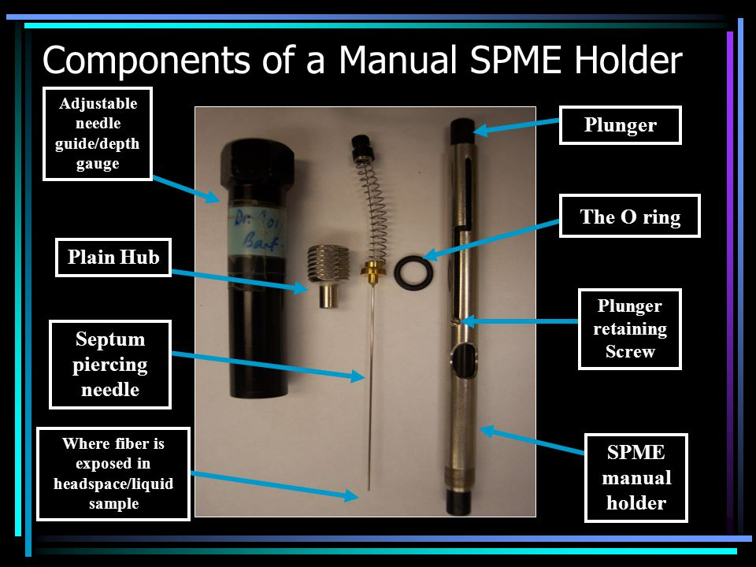
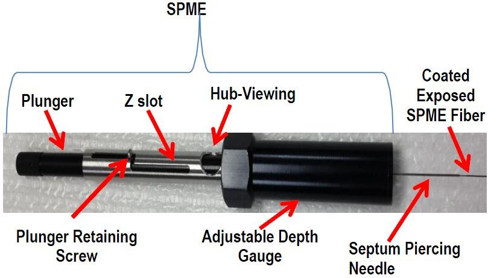
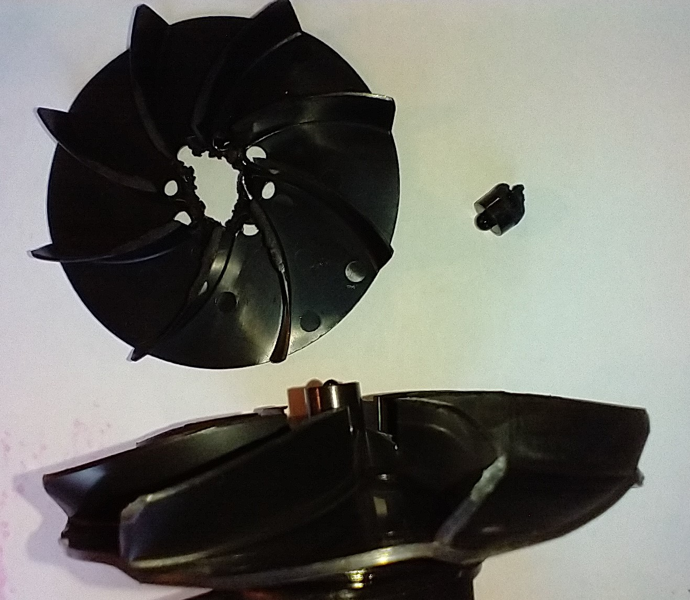

```{r setup, include=FALSE}
knitr::opts_chunk$set(echo = FALSE)

library(captioner)

#setting up captions for use in the document
# tab_nums <- captioner::captioner(prefix = 'Table')
fig_nums <- captioner::captioner()
```

### Safety Risks: Minimal
The air pumps make a loud noise and lithium ion batteries require care when handling. Roses have sharp prickles, wear gloves to protect from scratches. Hearing protection is recommended. There may be a risk of electric shock in rainy conditions. Wear appropriate protection from the sun: sunscreen and water are recommended.

### Explanation of rationale behind experimental design:
For this experiment, we will be collecting headspace volatiles with Solid Phase Microextraction (SPME), a method which adsorbs the volatile organic compounds (VOCs) surrounding part of a plant to the SPME fiber. The adsorbed chemicals can then be desorbed with paired Gas Chromatography - Mass Spectrometery (GC-MS) equipment to identify the collected chemistry. SPME extraction is a flexible method which can collect the VOCs from just about anything you can get an container around. For our experiments, we rely on heat-treated oven bags, which are relatively chemically inert after cooking them in an oven at 50°C for a day or so. 

The purpose of these experiments is to collect the volatiles emanating from roses under various conditions, including: 

 - roses infested with eriophyid mites (plots: 5, 9, 24, 18)
 - roses treated with Acibenzolar-S-methyl (ASM, Actigard) (plots: 1, 6, 22, 17)
 - roses afflicted with Rose Rosette Disease (already sampled in Athens, GA)

####  Goal of study:
By sampling rose VOCs with SPME under these different conditions, we hope to find quantitative and/or qualitative differences in VOC compounds between rose treatments.

#### Hypotheses:
Our hypothesis formed from preliminary research where we observed that *A. swirskii* were preferentially attracted the RRD-infected roses. We think this might be due to differences in the VOCs released from uninfected vs. infected roses. Collecting and comparing chemistry between different roses should allow us to see any qualitative and/or quantitative differences in VOCs released between these groups. This data will give us insight into some of the metabolic changes which may have occurred between different rose groups. Furthermore, our data should indicate which chemicals are worth testing for attractiveness to *A. swirskii* in olfactometer trials, which can give us insight into which specific VOCs *A. swirskii* may have been responding to from the RRD-infected roses. There is also a secondary assumption involved: it is assumed that *A. swirskii*' may be associating these changes in VOCs with their prey--herbivorous mites--which is why they are attracted to RRD-infested roses. Infected roses have populations of *Phyllocoptes fructiphilus*, the vector of RRD. Although these mites generally are inaccessible to *A. swirkii* (due to their cryptic habits of living among the dense trichomes present on the adaxial surfaces of rose sepals), both mite and virus likely reduce/change plant defenses. Reducing plant defenses in many cases is advantageous for other herbivores feeding on the infected plants and increase their populations. It might be that predatory mites are more successful at finding prey due to larger herbivore populations present on infected roses. This is where the Acibenzolar-S-Methyl (ASM, Actigard) treatments come in: ASM is an analogue of Methyl Salicylate (MeSA), a chemical which activates Systemic Acquired Resistance (SAR), part of a plant's immune response to pathogen attack. The SAR pathway releases a number of chemicals which are involved with a plant's ability to combat pathogens and fungi, as well as effects on predatory mites and herbivorous mite biology and behavior. Specifically, MeSA has been reported to be attractive to some predatory mites, and we would expect to see changes in the levels of MeSA released by RRD-infected plants as well as plants which have been induced with ASM.


### Materials for in-field VOC extraction via SPME:

##### Equipment for headspace concentration:
 - GoBeGreen Original Garden Bags - Nylon - One per sample + Backups (precooked in oven at 50°C for 24 hours or more)
 - Zip ties - 6 + per each sample, bring a large number
 - Heavy duty shears (for cutting zip ties and holes in the bags)
 - Bypass pruners (optional, for removing dead canes, allowing better access to rose flowers)
 - Mini inline filters, Blue (for outflow)

##### Clean air system:
 - 3 high volume air inflators (24v, 25 CFM)  w/ nozzle attachments
 - 6-8 lithium ion (24v, 4.0 Ah) power tool batteries (charged)
 - 2 variable flow meters with PTFE tubing
 - 2 In line Hepa Sanitary Air Filters for 1/4 in tubing (attached to flow meter)
 - 2 inline water filter carbon blocks, one micron filtration

##### Positioning apparatus:
 - 2 Double Burette clamps (Orange)
 - 2 Aluminum Rods (3 ft, 1/4 in)
 - Hammer/Mallet

##### Solid Phase Microextraction (SPME):
 - 2 Manual SPME holders
 - 9 SPME fibers (Gray) - 24 Ga Divinylbenzene/Carboxen/Polydimethylsiloxane (DVB/CAR/PDMS)
  - Nonyl acetate (keep cool)
 - 1 Drummond Scientific Aspirator, Captrol III
 - 5 ul glass calibrated micropipettes

### Methods:
Herbivorous mites tend to be found on the tender plant tissues found on actively growing parts of the rose, as well as flowers. With this in mind, we want to select rose canes with flowers, where the prey of *A. swirskii* are likely to be found. Selecting a flowering can also collects a greater diversity of VOCs than we would otherwise if we only sampled leaf or cane tissues. Although the actual VOC extraction takes only around 20 minutes, the entire process requires at least an hour of wait time to allow VOCs to concentrate in our oven bags before we can begin SPME. Our lab has two SPME holders available, so two extractions can be done at once. Temperature has a large effect on VOC collection, so it is in our best interest to do as many as many SPME extractions as possible during the same field visit to minimize environmental variables. Also, it is important to record the date of extractions so we can collect and report weather information for that day. The SPME fibers are fragile, and can break if the needle becomes excessively bent: take care to guide the septum piercing needle as you perforate the bag for VOC extraction. Be diligent in remembering to uncock the plunger when you are done with extraction/injection; removing the needle with the fiber exposed can break it. Lastly, take care to ensure that the fiber does not come into contact with the rose during extraction.

#### Steps for in-field VOC extraction via SPME:

##### 1. Bag a rose cane with flowers:
 1. Select a a single rose cane with a cluster of flowers and gently cover it with an oven bag. 
 1. Seal the end of the oven bag over the base of the rose cane with a zip tie so that the air is trapped around the flowers and cane. 
 1. Let the seal bag rest for one hour to concentrate the headspace volatiles before using SPME.

##### 2. Set up the clean air system:
 1. Attach the PTFE hoses to the bottom of the Sho-rate variable flow meters and the HEPA filters to the top. **Note the direction of airflow arrow on the HEPA filter**
 1. Attach the black plastic nozzle to the outlet (refer to direction of airflow arrow) of the carbon filter
 1. Attach the air inflator to the intake of the carbon filter
 1. Attach the battery to the air inflator

##### 3. Setup the positioning apparatus:
 1. Slide the burette clamp over the aluminum rod and position it near to the bagged rose cane. 
 1. Gently tighten the locking screw until the clamp stays firmly in place.
 1. Hammer the aluminum rod into the ground so that it will not tip over during VOC extraction.

##### 4. Assemble the manual SPME holder: 
 1. An image of the assembled manual SPME holder and its constituent parts is provided in Figure 3 in the Notes and Figures section
 1. Unscrew the needle guide/depth gauge from the plain hub
 1. Unscrew the plain hub and depress the plunger forward along the Z-slot to expose the internal threading of the plunger
 1. Screw the gray threaded end of the septum piercing needle into the plunger
 1. Gently withdraw the plunger, drawing it back along the Z-slot so that the brass section of the septum piercing needle seats flush at the end of the SPME manual holder
 1. Slide the plain hub over the end of the septum piercing needle until it can be screwed back onto the metal threads of the SPME manual holder.
 1. Adjust the O ring to depth mark 4 and screw the plain hub into the needle guide/depth gauge until the base of the guide is stopped by the O ring

##### 5. Collect VOCs with SPME
 1. After an hour of VOC concentration in in the bag, we are now ready to collect VOCs with SPME!
 1. Cut off one corner of the oven bag and insert the end of the PTFE tubing attached to the clean air system, then use a zip tie to seal the bag back over the PTFE tube
 1. Cut off the opposite corner of the bag, take the Drummond aspirator and a clean 5 ul glass micropipette to add 1 ul of Nonyl Acetate to the bag. 
 1. Leave the glass micropipette in the bag, insert the back end of the inline filter into the oven bag and seal it with a zip tie as well. **Please check the airflow arrow to make sure air is going out of the bag**
 1. Use the burette holder to clamp the manual SPME holder into position, then guide the septum piercing needle to puncture the bag so that the needle remains inside of the bagged air without coming into contact with the rose itself
 1. Expose the SPME fiber by depressing the plunger and sliding it forward along the Z-slot so it stays cocked
 1. Start the clean air system by turning on the air inflators and setting the airflow to 2.0. You may need to turn the variable airflow meter over so it reads correctly
 1. Leave the SPME fiber exposed to the headspace VOCs inside of the bag for 20 minutes
 1. Withdraw the SPME fiber by sliding the plunger backwards along the Z-slot
 1. Remove the manual SPME holder, disassemble it and swap out the gray septum piercing needle/fiber assembly for a new one for the next injection
 1. **Store the used septum piercing needle/fiber assembly in its container, label its position in the box and make a note of which plant plot the sample comes from**
 

### Experimental Site:

```{r, fig.height= 8, fig.width= 10, , warning = FALSE}
grid::grid.raster(tiff::readTIFF('rrd_field_trial_map_2021.tif'))
```


# Figures and Notes:

##### Assembled Field Extractor:
```{r, fig.height= 8, fig.width= 10, warning = FALSE}
knitr::include_graphics('spme_field_extractor.jpg')
```

`r fig_nums(name = "spme_field_extractor", caption = "Assembled clean air delivery system for in-field extraction of rose headspace volatiles via SPME")`

##### Burette holder
```{r, fig.height= 8, fig.width= 10, warning = FALSE}
knitr::include_graphics('spme_burette_holder.jpg')
```

`r fig_nums(name = "spme_burette_holder", caption = "The burette holder can be adjusted to different heights to accommodate the SPME holder in a variety of positions. Note the placement of the hoses and the blue inline filter.")`

##### Components of SPME holder:
```{r, fig.height= 8, fig.width= 10, warning = FALSE}


```

`r fig_nums(name = "spme_labeled", caption = "The SPME fibers are really fragile: please protect the needles from bending and make sure that the fibers do not come into contact with the plant during use.")`

##### Risks of overheating:
```{r, fig.height= 8, fig.width= 10, warning = FALSE}

```

`r fig_nums(name = "spme_melted", caption = "The air pumps will overheat in direct sunlight, especially when ambient temperatures are over 32°C (90°F). To prevent damaging the equipment, try to keep inflators insulated from heat, and in the shade if possible. Take care to avoid obstructing the intake vents. When the air pumps overheat, it melts the internal fans and creates a situation where the motor melts through the internal wiring, completing circuit and preventing the power switch from functioning while the battery is still attached. If you are not able to turn off the air pump with the toggle switch (without removing the battery), then **the air pumps are permanently damaged, and should be replaced immediately.** Also, you will need to remove any particulates of melted fan matter from the carbon block filters (just shake it out).")`


*last modified: `r format(Sys.time(), '%d %B %Y')`*