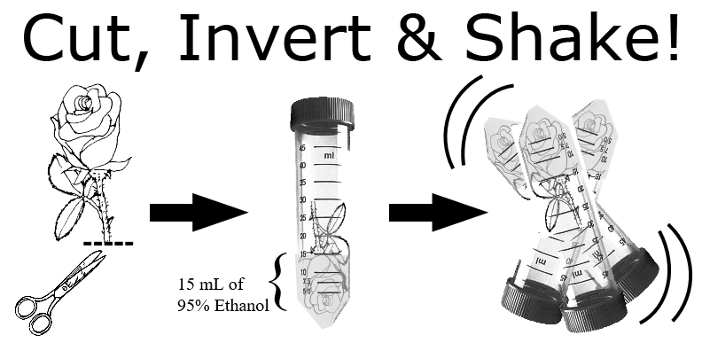

```{r setup, include=FALSE}
knitr::opts_chunk$set(echo = FALSE)
```

# Biocontrol of _Phyllocoptes fructiphilus_ {#athens-trial}

**Plot Map and Applications**

```{r}
knitr::include_graphics('pmite_map_2019_athens.png')
```

**Plot Design**

There are five blocks: A, B, C, D and E. Each block is a 3 $\times$ 6 plot with 18 plants, with three plants in each treatment. This is a 12 week experiment. We will be sampling flower cuttings from two rows each week, starting with the top rows (1-15 and 16-30 for week one) of each block and rotating to the next row each week (31-45 and 46-60 on week 2) continuing until all rows have been sampled three times. In order to avoid confusion, each rose pot should be labeled with a stake that has the plant number and treatment abbreviation: (W, A, K, M, N, +) written on it. Applications should be done on the same day each week, weather permitting, preferably at the beginning of the week. Please review 'pmite_map_2019_athens.pdf' for plot arrangement and spray treatments.

**Treatments**

1. Water - Control
1. Actigard - 100 mg/L (Full rate)
1. Ninja - Full rate
1. Kontos - Full rate
1. *A. swirskii* (one sachet per rose - 15 sachets)
1. *A. swirskii* + Ninja (one sachet per rose - 15 sachets, Full rate)

**Supplies**

- 95\% Ethanol
- Centrifuge Tubes with racks, 50 mL
- Wooden Plant Stakes


**Mite infestation and predatory mites**

- *Phyllocoptes fructiphilus*: rose cuttings ~12 cm should be taken from roses showing symptoms of Rose Rosette Disease and placed in each rose pot on the 1st, 5th and 9th week of the experiment.

- *Amblyseius swirskii* mites should be applied on the 1st, 5th and 9th week of the experiment. Follow the application instructions for 'mini sachets with hooks' given in the attached 'Ambly-S.pdf'. These sachets contain live colonies of *A. swirskii* and a mite which they consume for food. There is a small hole at the bottom of the sachet where the mites will leave and climb on the roses searching for food. The mites have optimal reproduction at ~25&deg;C and ~75\% RH, but will be find so long as they are not refrigerated or exposed to extreme heat.

**Data Collection**

- Georgia collaborators will be collecting flower samples from *all* roses only twice: once before beginning the treatments on week 1 and once at the end of the experiment on week 12.

- For weeks 2 through 11, Georgia collaborators will collect flower samples starting from the top rows of each block every week, until each row has been sampled three times (see 'pmite_map_2019_athens.pdf').

- Georgia collaborators will be rating disease severity for each rose every week before they spray, rating roses according to the Horsfall-Barratt Scale as described in the 'disease_severity_scale.docx' file. The same people should be taking the ratings each week to avoid differences between observers.

- Once a rose shows symptoms of Rose Rosette Disease, take a sample of the infected tissue and please send it to Dr. Fanny Iriarte:

Plant Disease Diagnostic Clinic  
155 Research Road  
Quincy, FL 32351  
Phone: 850-875-7140  
Fax: 352-846-6617  
fbiriarte\@ufl.edu  


**Sample Processing** 

- 50 ml centrifuge tubes should be labeled on the side with the date, block, plant number and treatment abbreviation (W, A, K, M, N, +). The lid should be labeled with block and plant number, then the tube filled with 15 ml of 95% ethanol.

- Take a flower cutting large enough to fill the centrifuge tubes provided (about ~12 cm) and place the flower petal side down in the tube so the entire flower is submerged in alcohol over the sepals. Make sure the lid is tight, then shake the tube vigorously for a few seconds to help dislodge any mites. Make sure that no alcohol gets on the exterior of the tubes and dissolves labels, otherwise the labels should be rewritten. These tubes should be stored vertically so that the flower and sepals remain submerged in the alcohol. These tubes can be kept at room temperature until Austin visits to count mites on the 5th and 10th week.

```{r}

knitr::include_graphics('tube_rack.png')
```

If there are any questions, comments, data loss or problems, please call or email Dr. Xavier Martini (xmartini\@ufl.edu, 850-875-7160) or Austin Fife (afife\@ufl.edu, 208-874-2283) as soon as possible.

*last modified: `r format(Sys.time(), '%d&period; %B %Y')`*